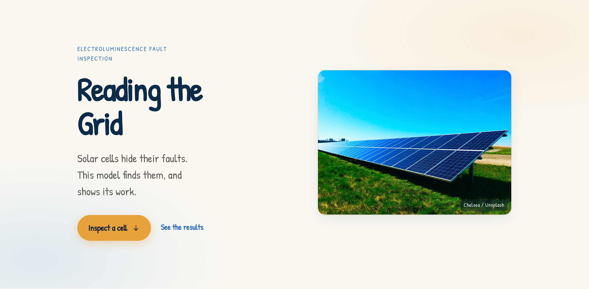
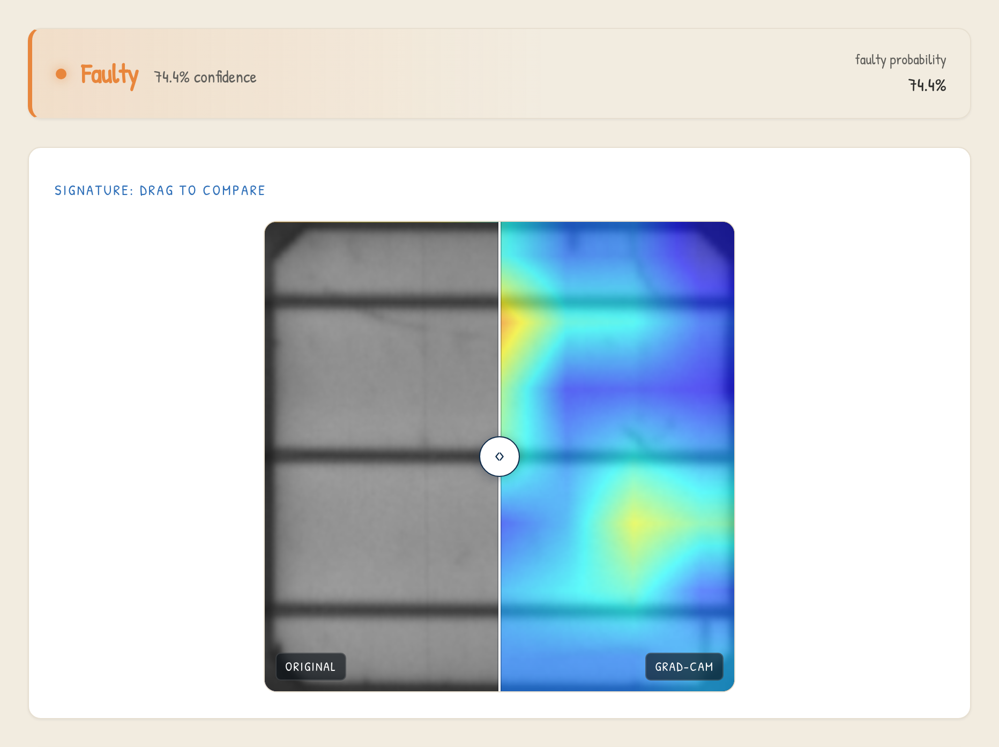
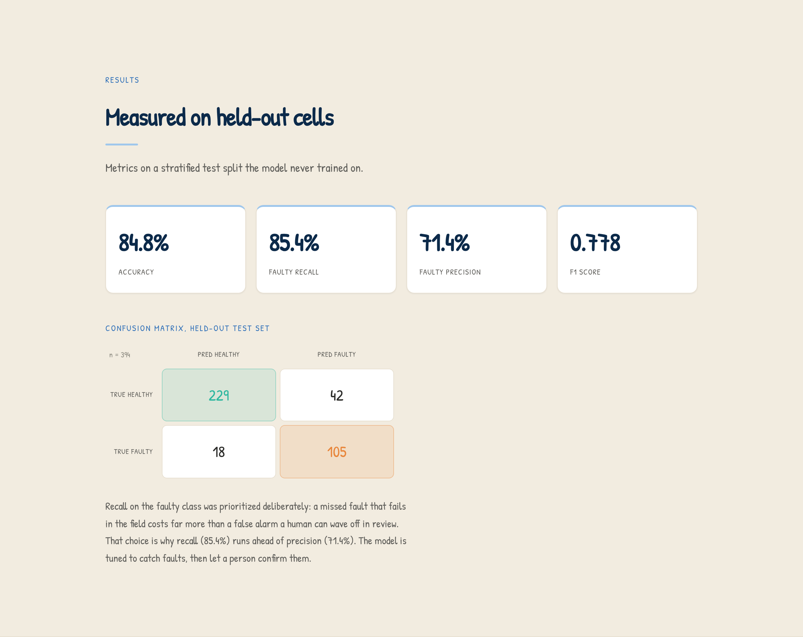

# Reading the Grid

**Solar-cell fault detection from electroluminescence images, with an interpretable Grad-CAM heatmap that shows where the model looked.**

<p>
  <a href="https://huggingface.co/spaces/RichelCode/reading-the-grid"></a>
  
  
  
  
  
</p>

A convolutional neural network that flags faulty solar cells from electroluminescence (EL) imaging, paired with a Grad-CAM overlay so a human inspector can see the region that drove each prediction. It ships as a single Docker container: a FastAPI model server and a React front end, deployed live on Hugging Face Spaces.

**Try it live: [huggingface.co/spaces/RichelCode/reading-the-grid](https://huggingface.co/spaces/RichelCode/reading-the-grid)**



## What it does

Solar farms hold millions of cells. Micro-cracks, broken interconnects, and dead regions often leave no visible mark on the surface, but under electroluminescence imaging (a current is run through the cell and its infrared glow is captured) those faults show up as dark areas. Inspecting every cell by hand does not scale.

This project trains a binary classifier (healthy vs. faulty) on EL cell images and returns, for each cell:

- a **faulty probability** and a label at an adjustable decision threshold,
- a **Grad-CAM heatmap** overlaid on the cell, shown as a drag-to-compare view against the original.



## Key results

Measured on a stratified, held-out test split the model never trained on (n = 394).

| Metric | Score |
| --- | --- |
| Accuracy | 84.8% |
| Faulty recall | 85.4% |
| Faulty precision | 71.4% |
| Faulty F1 | 0.778 |

**Confusion matrix**

|  | Predicted healthy | Predicted faulty |
| --- | --- | --- |
| **True healthy** | 229 | 42 |
| **True faulty** | 18 | 105 |

Recall on the faulty class was prioritized deliberately: a missed fault that fails in the field costs far more than a false alarm a human can wave off during review. That trade-off is why recall (85.4%) runs ahead of precision (71.4%). The model is tuned to catch faults, then let a person confirm them.



## How it works

1. **Transfer learning.** The backbone is an ImageNet-pretrained ResNet18. It already knows how to see edges, textures, and shapes, so it does not have to learn vision from scratch on a relatively small solar dataset. The classification head is replaced for two classes, and training uses a class-weighted loss to handle the healthy/faulty imbalance.
2. **Fine-tuning.** The last residual block (`layer4`) is then unfrozen and specialized to EL imagery at a low learning rate, while earlier layers stay frozen. This adaptation lifted faulty recall from **0.72 to 0.85** without destroying the pretrained features. The best-F1 checkpoint on the validation set is kept.
3. **Grad-CAM.** Gradients into the last convolutional block produce a heatmap of the regions the model weighted most, overlaid on the input so the prediction is inspectable rather than a bare label.

## Limitations

Stated plainly, because knowing the failure modes is part of using the tool well.

- **Grad-CAM is normalized per image**, so it shows relative attention, not fault severity, and never goes fully quiet, even on a healthy cell.
- **Faulty localization is partial.** The highlighted region overlaps real defects only some of the time. Read it as a hint, not a segmentation mask.
- **The model reads EL scans, not daylight photos** of a panel. Ordinary camera images are out of distribution.
- This is an **inspection-assist aid, not a calibrated localizer.** Use it to prioritize a human review, not to certify a cell.

## Architecture

A two-part application packaged as one container:

- **Backend (FastAPI).** Loads the fine-tuned ResNet18, runs inference and Grad-CAM, and exposes `POST /api/predict`. It returns the raw faulty probability, the label at the default threshold, and the original image and heatmap overlay as base64 PNGs. The model is loaded once and warmed at startup; inference runs off the event loop.
- **Frontend (React + TypeScript + Tailwind).** Single-page site with the live demo embedded. Because the API returns the raw probability, the decision-threshold slider is applied client-side with no re-fetch, so moving it re-labels instantly.
- **Delivery.** A two-stage Docker build compiles the front end to static files, then serves them and the API from one process on port 7860, deployed to Hugging Face Spaces.

## Tech stack

- **Model:** PyTorch, torchvision (ResNet18), `pytorch-grad-cam`, scikit-learn (metrics/splits), trained on Apple Silicon (MPS) and served on CPU.
- **Backend:** FastAPI, Uvicorn, Pillow, NumPy, OpenCV.
- **Frontend:** React 19, TypeScript, Tailwind CSS v4, Vite.
- **Delivery:** Docker (single container), Hugging Face Docker Spaces.

## Local setup

```bash
# 1. Clone and enter the project
git clone https://github.com/RichelCode/reading-the-grid.git
cd "Reading the Grid"

# 2. Create a virtual environment and install Python dependencies
python3 -m venv venv
source venv/bin/activate          # macOS / Linux
pip install --upgrade pip
pip install -r requirements.txt
```

Model weights are **not** committed (`*.pth` is git-ignored). Regenerate them by running training; the best checkpoints are written to `models/`:

```bash
python src/train.py        # frozen-backbone transfer learning -> models/best_model.pth
python src/finetune.py     # unfreeze layer4, fine-tune    -> models/best_model_finetuned.pth
```

Run the web app locally (two processes; the Vite dev server proxies `/api` to the backend):

```bash
# Backend, from webapp/backend
uvicorn main:app --reload --port 8000

# Frontend, from webapp/frontend
npm install
npm run dev
```

For the single-container production build and Hugging Face deployment, see [`webapp/README.md`](webapp/README.md).

## Project structure

```
Reading the Grid/
├── src/                # Model, dataset, training, and fine-tuning
│   ├── model.py            # ResNet18 transfer-learning classifier + device selection
│   ├── dataset.py          # ELPV dataset, transforms, stratified dataloaders
│   ├── train.py            # Class-weighted training loop (frozen backbone)
│   └── finetune.py         # Unfreeze layer4 and fine-tune at a low learning rate
├── notebooks/          # Data exploration and verified Grad-CAM interpretation
├── webapp/             # Production web app
│   ├── backend/main.py     # FastAPI: /api/predict (inference + Grad-CAM) + static serving
│   ├── frontend/           # React + TypeScript + Tailwind single-page site
│   └── Dockerfile          # Two-stage single-container build for Spaces
├── deploy/             # Hugging Face Space deploy script and Space README
├── models/             # Saved weights (git-ignored; regenerated by training)
└── requirements.txt
```

## Dataset

Trained on the **ELPV dataset** of electroluminescence solar-cell images (Buerhop-Lutz et al.; Deitsch et al.), used here for **non-commercial research purposes**. Continuous defect-probability labels are binarized to healthy vs. faulty. Raw data is not committed to this repository.

## Credits

Built by **Richel Attafuah**.

- Live demo: [huggingface.co/spaces/RichelCode/reading-the-grid](https://huggingface.co/spaces/RichelCode/reading-the-grid)
- Source: [github.com/RichelCode/reading-the-grid](https://github.com/RichelCode/reading-the-grid)
